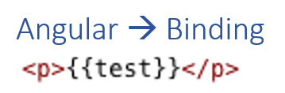
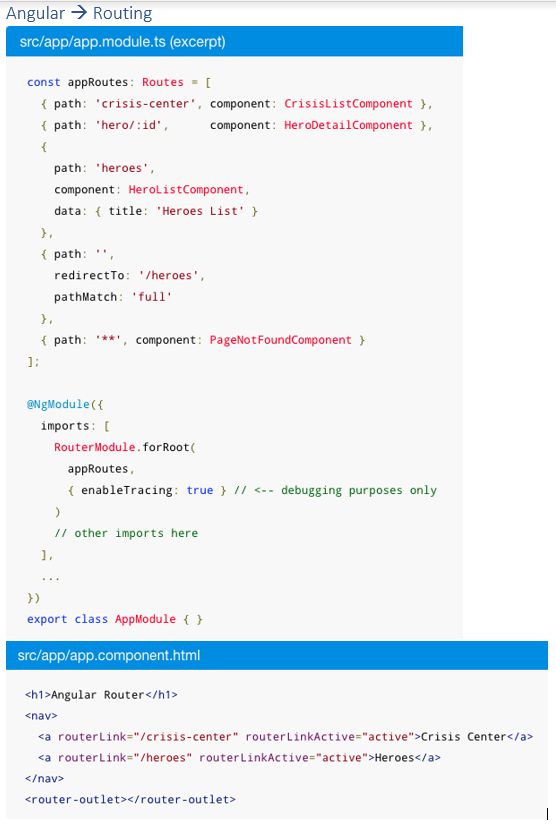
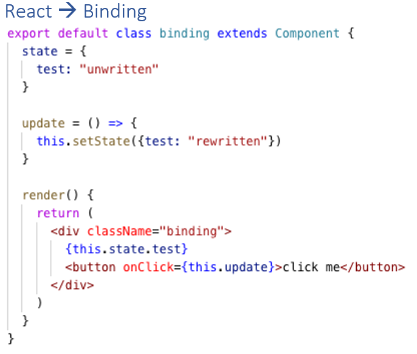
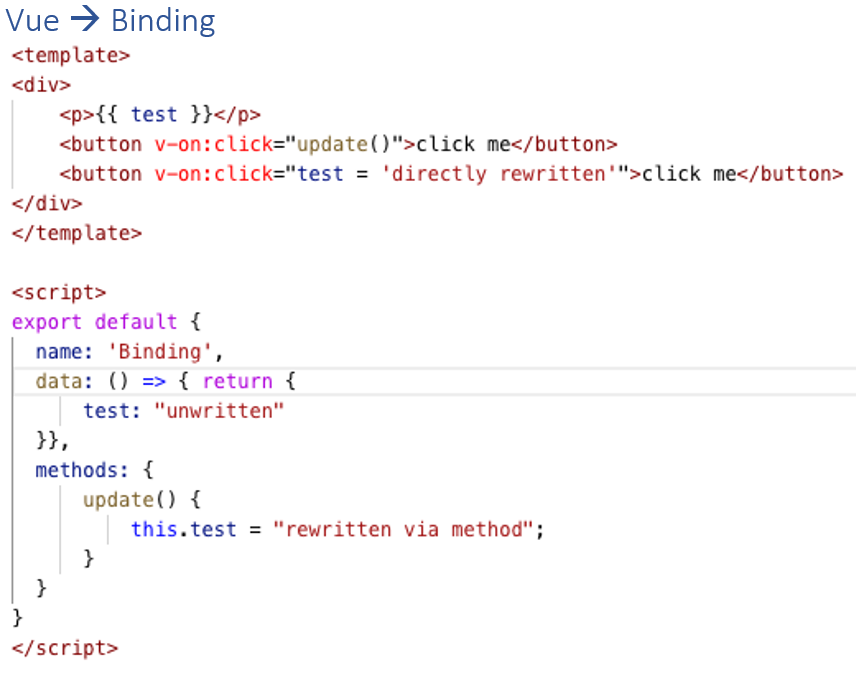
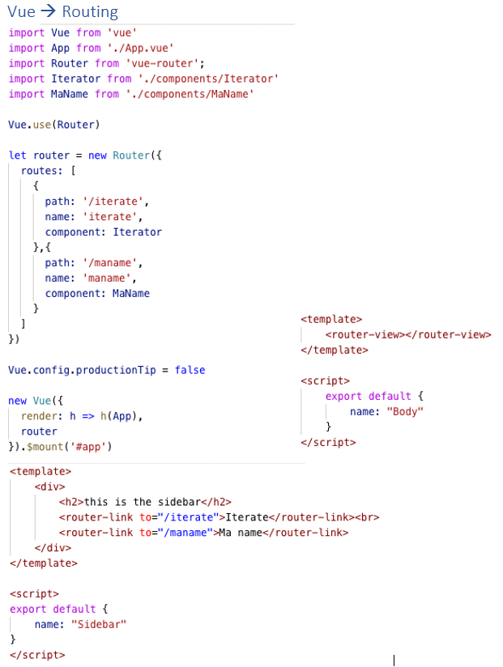

= JavaScript + Frameworks
////
++++
<link rel="stylesheet"  href="http://cdnjs.cloudflare.com/ajax/libs/font-awesome/3.1.0/css/font-awesome.min.css">
++++
////
:icons: font

== Was ist JavaScript?
*Skriptsprache*, um _dynamische_ HTML-Seiten per Webbrowser anzuzeigen. 

TIP: Dynamische Webseiten kommunizieren mit dem Server und sind nicht fest verankerter HTML-Code

JavaScript kann sowohl für die *objektorientierte* als auch für die *prozedurale* und *funktionale* Programmierung genutzt werden.

TIP: Prozedurale Programmierung ist ein Programmierparadigma (=grundlegender Stil). Dabei wird die Gesamtaufgabe, die eine Software lösen soll, in kleinere Teilaufgaben aufgelöst. Bei der OOP werden Objekte und Klassen verwendet…)

JavaScript sorgt dafür, dass Webseiten sich dynamisch aufbauen und dem Benutzer anpassen können. Es können komplexe Kontrollabfragen programmiert und mit Datenbanken verknüpft werden, um die Eingaben der Besucher zu prüfen. +
JavaScripts werden innerhalb des HTML-Codes einer Webseite eingefügt und werden dann durch den Browser ausgeführt. Das bedeutet: Solange ein Browser JavaScript nicht ausführt, wird die dahinterstehende Aktion auch nicht geschehen. +

Mit JavaScript kann man den Browser dazu bringen, im Hintergrund Befehle und Inhalte von anderen Seiten zu laden. +
Man sieht sich eine Webseite an und parallel dazu laden Scripts Aktionen von anderen Servern nach. Was, wenn die Programmierer nun etwas ganz anderes nachladen würden? Wenn sie einen Trojaner laden, der sich in das OS einnistet?

WARNING: Sogenannte *Drive-by-Infektionen* kommen bei infizierten Webseiten vor, auch wenn diese nur ganz kurz besucht werden.

== Funktionen sind Objekte
Prototype *$$__$$proto$$__$$* ist die Basisklasse bei der Vererbung in JavaScript. 
TIP: $$__$$proto$$__$$ ist deprecated (=veraltet) und soll nur für Debug-Zwecke verwendet werden. Es gibt die sogenannte “prototypical inheritance”, diese wird jedoch nicht mehr verwendet, da die Vererbung mit den ES6 Classes deutlich schneller geht.

[source, javascript]
function Circle(radius) {
    this.radius = radius;
    this.draw = function () {
        console.log('draw');
    }
}

Befehle in der Browser Konsole: 

. Circle.name
. Circle.length
. Circle.constructor 

TIP: circle (circle Objekt) -> $$__$$proto$$__$$ ist “Object”

== Clonen eines Objekts

[source, javascript]
const clonedCircle = Object.assign({}, circle);

Bei *Object.assign({}, circle)* werden alle Properties und Methoden von circle in den ersten Parameter – in dem Fall ein leeres Objekt – kopiert und anschließend returned. 
TIP: Es können ebenfalls mehrere Objekte zu einem Objekt zusammengefügt werden.

[source, javascript]
const otherCircle = { ...circle };

Der Spread Operator (*...*) holt sich alle Properties und Methoden des Objekts und gibt es in ein anderes Objekt (_otherCircle_). 

== Hoisting
TIP: Wenn die JavaScript Engine den Code ausführt werden automatisch alle Function Declarations und Variablen nach oben gebracht – auch *Hoisting* genannt.

Somit kann eine Variable verwendet werden bevor diese überhaupt deklariert worden ist.

[source, javascript]
x = 5;
elem = document.getElementById("demo"); // Find an element
elem.innerHTML = x; 
let x = 1; // declare 'x'

== Erstellen eines Objekts
Es gibt 3 Wege, in JavaScript Objekte zu erstellen. 

TIP: Der erste ist mit der *Object Literal Syntax*

In den geschweiften Klammern („curly braces“) können sich Key-Value Pairs befinden – in folgendem Beispiel: radius, location und draw. Radius und Location sind Properties, draw ist eine Methode.

[source, javascript]
// Object Literal Syntax
const circle1 = {
    radius: 1,
    location: {
        x: 1,
        y: 0
    },
    draw: function () {
        console.log('draw');
    }
};

Will man nun jedoch mehrere circle Objekte haben, müsste man den Code kopieren. +
Dies führt zu unnötigen Redundanzen, da – unter anderem – dieselbe Methode mehrfach im Code ist.

TIP: Besser ist es in diesem Fall, via einer *Factory Methode* oder eines *Konstruktors* Objekte zu erstellen

Factory Methode
[source, javascript]
function createCircle(radius) {
    return {
        radius,
        location: { // hardcoded
            x: 1,
            y: 0
        },
        draw: function () {
            console.log('draw');
        }
    };
}
const circle2 = createCircle(2); //Aufruf

Konstruktor
[source, javascript]
function Circle(radius) {
    this.radius = radius;
    this.location = { // hardcoded
        x: 1,
        y: 1
    }
    this.draw = function () {
        console.log('draw');
    }
}
const circle3 = new Circle(3); //Aufruf

== ECMAScript 6 (ES6)
TIP: ECMA	Script 6, ES6 oder ES2015 ist die offizielle Spezifikation von JavaScript und die neueste Version des ECMAScript Standards.

Zu den Neuerungen zählen (unter anderem):

. let und const
.	Arrow Functions
.	Classes

Unterstützt wird ES6 von den Webbrowsern Firefox, Chrome, Edge, Safari und Opera.

== ES6 Classes
TIP: Die ES6 Classes sind eine *Syntaxerweiterung* - umgangssprachlich auch "syntactic sugar" genannt - und ermöglichen zusätzlich zu *Getter & Setter* auch eine einfache *Vererbung*

[source, javascript]
const _radius = new WeakMap(); // private
const _move = new WeakMap();   // private
class Circle {
    constructor(radius) {
        _radius.set(this, radius);
        _move.set(this, function () {
            console.log('move');
        })
    }
    draw() {
        _move.get(this)(); // ist eine Methode, deshalb -> ()
        console.log('draw');
    }
    get radius() { // getter
        return _radius.get(this);
    }
    set radius(value) { // setter
        _radius.set(this, value);
    }
}
const c = new Circle(1); // Aufruf

Eine WeakMap ist vergleichbar mit einer *HashMap in Java* (oder Dictionary in C#). Die Keys Objekte sind und die Values irgendeinen Wert annehmen können. +
Der Grund für die Namensgebung ist, dass wenn auf einem Key keine Referenz ist, dieser vom Garbage Collector aufgeräumt wird. 

TIP: Durch die WeakMap wird die Property bzw. die Methode *private*.

Vererbung:
[source, javascript]
class Shape {
    constructor(color) {
        this.color = color;
    }
    move() {
        console.log('move shape');
    }
}
class Circle extends Shape { // extends (!!) (funktioniert wie in Java)
    constructor(color, radius) {
        super(color);
        this.radius = radius;
    }
    draw() {
        console.log('draw circle');
    }
}
const c = new Circle('red', 1); // Aufruf

== Übersicht JavaScript-Frameworks 
In der JavaScript-Welt spricht man immer häufiger von „Framework Fatigue“: Der Markt wird so sehr mit Frameworks und den dahinterstehenden Technologien und Konzepten überflutet, dass Entwickler schnell den Überblick verlieren können. Dabei ist die Entscheidung für ein Framework wesentlich für eine Webanwendung, ein Wechsel des Frameworks während der Implementierung erfordert erheblichen Aufwand.

NOTE: In den letzten Jahren haben sich *Angular, React und Vue* einen fixen Platz an der Spitze reserviert

== JavaScript vs. TypeScript
TIP: TypeScript ist eine von Microsoft entwickelte Programmiersprache, die auf dem ECMAScript-6-Standard basiert.

TypeScript Code wird in JavaScript Code umgewandelt – er wird also transpiliert.

TIP: *JavaScript ist TypeScript*. Damit meint man, dass eine .js Datei in eine .ts Datei fehlerlos umbenannt werden kann.

TIP: TypeScript ist eine objekt-orientierte Programmiersprache, während JavaScript genau genommen eine Skriptsprache (= wird über einen Interpreter ausgeführt) ist.

== Angular
TIP: Angular ist ein TypeScript basiertes JavaScript Framework, welches von Google veröffentlicht wurde und als Open-Source-Software unter der MIT-Lizenz verfügbar ist.

Aufgrund des *MVVM*-Ansatzes (Model-View-ViewModel) können insbesondere Webapplikationen entwickelt werden, die stark auf die *Interaktion mit den Benutzern* ausgelegt sind.

Google, die Zeitschrift TheGuardian und Weather.com verwenden Angular.

NOTE: Zusammengefasst und leicht (bis sehr stark gekürzt) ist Angular *plattformunabhängig* (Desktop, Mobile, Tablet) und *komponentenbasiert*.

== React
React wurde als interne Lösung für Facebook entwickelt. 2013 wurde React dann für die Community zugänglich gemacht, seitdem ist React als Open-Source-Projekt verfügbar.

Im ersten Vergleich zu Angular fällt direkt auf, dass React sich selbst als *JavaScript Bibliothek* beschreibt und *nicht* wie beispielsweise Angular als ein *Framework*.

NOTE: React ist dafür entwickelt worden möglichst performante Oberflächen zu gestalten. 

Dabei werden einfache Views für jeden Teil der Applikation erstellt und React kümmert sich im Hintergrund darum, die Änderungen der Daten innerhalb der View zu reflektieren. +
Bei der Datenanzeige geht React sogar einen Schritt weiter und verwendet einen sogenannten *virtuellen DOM*.

TIP: Das DOM (Document Object Model) ist die Schnittstelle zwischen HTML und dynamischem JavaScript. Es handelt sich um eine Baumstruktur, die aus dem HTML-Code aufgebaut wird, den der Server dann an den Browser sendet.

TIP: Das virtuelle DOM ist eine abstrakte Kopie des tatsächlichen DOMs, die deutlich kleiner ist und auf das nötigste an Informationen beschränkt ist.

Wann immer an diesem virtuellen DOM ein Update passiert, werden beide Varianten des DOMs durch einen Algorithmus verglichen und die Unterschiede dann gebündelt und in einem Schritt im tatsächlichen DOM angepasst.

TIP: React ist ebenfalls komponentenbasiert. Die Anwendung wird also in logisch trennbare Einheiten unterteilt und unabhängig voneinander behandelt.

Dabei sind an dieser Stelle zwei weitere Unterschiede zu Angular anzumerken:
1. In React wird sowohl die *Logik* als auch das *Template* einer *einzelnen* JavaScript Datei verwaltet. 
Das ist ungewohnt, da die meisten Entwickler mit Patterns wie MVC oder MVVM vertraut sind und die Vorzüge dieser Arbeitsweise genießen. Dabei kann man React am besten mit der View im MVC Pattern vergleichen.
2. In React wird *HTML Code innerhalb einer JavaScript Klasse* geschrieben, und zwar im *JSX-Format*. Die JSX Syntax ähnelt dem klassischen HTML. Im Vergleich dazu versuchen Frameworks wie Angular immer JavaScript Funktionen wie ngFor innerhalb gewohnter HTML Syntax einzubauen.

Firmen wie WhatsApp, Instagram, PayPal und BBC verwenden React.

image::Angular_React_Vue/react_routing.png[]

== Vue
Veröffentlich wurde das Framework im Jahr 2014 durch den ehemaligen Google-Mitarbeiter Evan You als Open-Source-Software. +
Genauso wie React wurde Vue mittels JavaScript umgesetzt, allerdingst bietet es auch eine Unterstützung für TypeScript an.

TIP: Vue bietet dem Nutzer passend zum Anwendungszweck Skalierungsmöglichkeiten an. 

Es kann zwischen einer *leichtgewichtigen Bibliothek oder einem gesamten Framework* ausgewählt werden. Vue kann zur Integration in bestehende Projekte genutzt werden. 

Firmen wie GitLab oder 9GAG verwenden Vue.

== Kontext 
NOTE: JavaScript Frameworks dienen lediglich als Frontend. Meistens besteht eine Kommunikation zum Backend – wie beispielsweise JakartaEE. 
Mittels der *fetch(…)* Methode in JavaScript kann man Requests abfangen und danach weiter verarbeiten.

== Performance
. Angular: real DOM -> langsam
. React: virtual DOM -> schnell
. Vue: virtual DOM -> schnell

== Framework Größe
. Angular: 500+ KB
. React: 100 KB
. Vue: 80KB

== Flexibilität
NOTE: Angular lieferat alles was man braucht, ist jedoch nicht recht flexibel. React und Vue sind beide deutlich flexibler als Angular.

== Schlussfolgerung
NOTE: Angular ist am geeignetsten für größere Projektteams und UI Applikationen. Vue und React sind geeignet für eher leichtgewichtigere und kleinere Applikationen, unter anderem aufgrund der größeren Flexibilität.

== Quellen
https://developer.mozilla.org/de/docs/Web/JavaScript/Reference/Global_Objects/Array/Reduce +
https://medium.com/hackernoon/angular-vs-react-vs-vue-which-is-the-best-choice-for-2019-16ce0deb3847 +
https://medium.com/brickmakers/react-eine-einf%C3%BChrung-in-f%C3%BCnf-minuten-515dc38ceb73 +
Udemy Course von Mosh Hamedani: “JavaScript Basics for Beginners” +
Udemy Course von Mosh Hamedani: “Object-oriented programming in JavaScript” +

